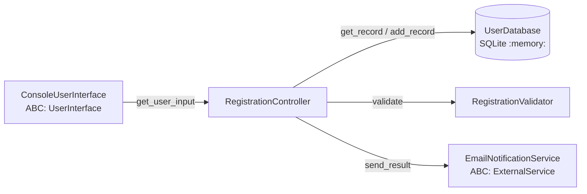

# 📘 Руководство к защите Лабораторной работы №3

## 📌 Тема работы
**«Интеграционное тестирование проектов и работа с тестовыми заглушками»**  
**Дисциплина:** Проектирование и тестирование программных модулей (ПТПМ)  
**Репозиторий:** `https://github.com/romanovro-arch/PTPM-VKI`  
**Ветка:** `Lab3`

---

## 🚀 Как запускать проект

### 1. Запуск всех тестов (основная команда для демонстрации преподавателю):
```powershell
python -m unittest test_integration.py -v
```
> Выведет подробный список всех 7 тестов и итоговый статус `OK`.

### 2. Запуск приложения в интерактивном режиме:
```powershell
python main.py
```
> Запустит консольный ввод данных и выполнит полный цикл регистрации с сохранением в локальную базу данных `users.db`.

---

## 📂 Структура проекта и назначение файлов

| Файл | Роль в проекте | Описание |
| :--- | :--- | :--- |
| **`registration_validator.py`** | Класс вычислений / валидации | Класс `RegistrationValidator`. Содержит метод `validate(login, password, password_confirm)`. Проверяет формат логина (телефон по маске, email, латинская строка от 5 символов, черный список) и сложность пароля (кириллица, оба регистра, цифры, спецсимволы, совпадение). |
| **`user_database.py`** | Класс работы с базой данных | Класс `UserDatabase` на базе `sqlite3`. Поддерживает создание базы в оперативной памяти (`:memory:`) для тестов и постоянный файл `users.db`. Реализует CRUD-методы: `add_record`, `get_record`, `delete_record`, `close`. Запись однозначно идентифицируется по трем полям: `(login, password, password_confirm)`. |
| **`user_interface.py`** | Класс взаимодействия с пользователем | Содержит абстрактный класс `UserInterface(ABC)` и конкретную реализацию `ConsoleUserInterface`, запрашивающую данные через `input()`. |
| **`external_service.py`** | Класс сторонней зависимости | Содержит абстрактный класс `ExternalService(ABC)` и реализацию `EmailNotificationService`, имитирующую отправку уведомления стороннему почтовому серверу. |
| **`registration_controller.py`** | Класс-контроллер (Controller) | Связывает все модули через паттерн **Dependency Injection (DI)**. Реализует бизнес-логику сквозного сценария: запрос ввода $\rightarrow$ проверка кэша в БД $\rightarrow$ валидация и сохранение при отсутствии $\rightarrow$ отправка стороннему сервису $\rightarrow$ возврат результата. |
| **`test_integration.py`** | Интеграционные и модульные тесты | 7 тестов с использованием фреймворка `unittest` и библиотеки заглушек `unittest.mock`. 4 теста являются интеграционными (сквозное взаимодействие Контроллера, Валидатора и реальной БД SQLite). |
| **`main.py`** | Главная точка входа | Инициализирует зависимости и передает управление в `RegistrationController`. |
| **`.gitignore`** | Конфигурация Git | Исключает из репозитория базы данных `*.db`, кэш `__pycache__` и временные логи. |

---

## 🏛 Архитектурные паттерны (вопросы по ООП)



### 1. Зачем нужны абстрактные классы (`ABC`)?
Классы `UserInterface` и `ExternalService` наследуются от `abc.ABC` и объявляют `@abstractmethod`.
* **Цель:** Задать строгий контракт (интерфейс). Класс-наследник обязан реализовать эти методы, иначе Python выбросит ошибку при создании объекта.
* **Гибкость:** Контроллер зависит от абстракции, а не от конкретной реализации (принцип инверсии зависимостей DIP из SOLID). Если мы заменим консоль на веб-интерфейс или GUI (Tkinter), код контроллера останется неизменным.

### 2. Что такое Dependency Injection (DI) в контроллере?
В классе `RegistrationController` все зависимости передаются через параметры конструктора:
```python
def __init__(self, ui, validator, db, external_service):
```
Контроллер **не создает** объекты внутри себя через `self.db = UserDatabase()`. Это делает систему слабо связанной и позволяет в тестах легко подменять реальные объекты заглушками (`Mock`).

### 3. Как устроена работа с SQLite базой данных?
* Таблица `registrations` содержит поля: `login`, `password`, `password_confirm`, `is_success`, `error_message`.
* Составной первичный ключ: `PRIMARY KEY (login, password, password_confirm)` обеспечивает уникальность согласно ТЗ.
* Используется конструкция **UPSERT**: `ON CONFLICT (...) DO UPDATE`, обновляющая запись при повторном сохранении.
* В тестах база создается со строкой подключения `":memory:"` — база живет в оперативной памяти, тесты работают мгновенно и не оставляют мусорных файлов на диске.

---

## 🧪 Теория тестирования и тестовые заглушки (Mocks)

### В чем разница между модульным (Unit) и интеграционным тестом?
* **Модульный тест (Unit test):** Проверяет один изолированный метод одного класса в изоляции от внешнего мира.
* **Интеграционный тест (Integration test):** Проверяет **совместную работу** нескольких реальных модулей системы (в нашем случае: совместная работа Контроллера, Валидатора и реальной БД SQLite).

### Зачем нужны `Mock`-объекты и тестовые заглушки?
1. **Изоляция пользовательского ввода:** В тестах недопустимо останавливать выполнение и ждать, пока человек введет логин в консоли `input()`. Заглушка `mock_ui.get_user_input.return_value = (...)` мгновенно подставляет тестовые данные.
2. **Изоляция внешних сервисов:** Тесты не должны зависеть от интернета или спамить реальные email-сервера. Заглушка `mock_external.send_result` принимает вызов и возвращает `True`.

### Разбор тестов в `test_integration.py`:
1. `test_integration_successful_registration_end_to_end`:
   * Сквозной тест успешной регистрации. Проверяет, что контроллер валидирует данные, физически вставляет запись в SQLite БД и вызывает внешний сервис с параметрами `("alex_99", True, "")`.
2. `test_integration_failed_registration_saves_error_to_database`:
   * Сквозной тест ошибки (короткий пароль). Проверяет, что ошибка валидации фиксируется в БД с `is_success=0` и передается внешнему сервису.
3. `test_integration_cached_record_skips_validation`:
   * Тест логики кэширования: если учетные данные уже есть в БД, контроллер извлекает результат из базы, а метод `mock_validator.validate` **не вызывается вовсе** (`assert_not_called()`).
4. `test_database_crud_lifecycle`:
   * Проверка полного жизненного цикла методов `UserDatabase`: добавление (`add_record`), чтение (`get_record`), удаление (`delete_record`), проверка отсутствия.
5. `test_console_user_interface_input_mock`:
   * Проверка консольного ввода с использованием `@patch("builtins.input")`. Эмулирует ввод трех строк пользователем и проверяет правильность сборки кортежа.
6. `test_integration_external_service_exception_handling`:
   * Проверка отказоустойчивости. Метод внешнего сервиса выбрасывает `ConnectionError` (сбой сети). Контроллер перехватывает исключение в блоке `try/except`, не падает и успешно завершает регистрацию.
7. `test_email_notification_service_send`:
   * Проверка метода отправки уведомления в `EmailNotificationService`.

---

## 💬 Топ-5 каверзных вопросов преподавателя и готовые ответы

**В: Докажите, что у вас есть минимум 3 интеграционных теста, а не просто модульные тесты с моками.**  
*О: В тестах `test_integration_successful_registration_end_to_end`, `test_integration_failed_registration_saves_error_to_database` и `test_integration_cached_record_skips_validation` тестируется реальное взаимодействие связки Контроллер + Валидатор + реальный движок SQLite БД. Данные физически записываются в таблицы SQLite и читаются из них. Моками закрыты только границы системы — консольный ввод человека и внешний почтовый сервер.*

**В: Зачем вы используете `:memory:` в конструкторе UserDatabase?**  
*О: Режим SQLite `:memory:` создает изолированную БД в оперативной памяти. Это обеспечивает максимальное быстродействие тестов и гарантирует их независимость (после каждого теста база уничтожается в методе `tearDown()`, исключая сайд-эффекты).*

**В: Что делает `@patch('builtins.input')` в тесте UI?**  
*О: Декоратор `@patch` на время выполнения тестового метода подменяет встроенную функцию Python `input()` в модуле `builtins` мок-объектом, возвращающим значения из списка `side_effect`. Это позволяет автоматизировать проверку консольного интерфейса без участия оператора.*

**В: Как контроллер определяет, нужно ли вызывать валидатор?**  
*О: Контроллер сначала обращается к базе данных через `db.get_record(login, password, confirm)`. Если запись найдена, он возвращает закэшированный статус, экономя вычислительные ресурсы. Если записи нет — вызывает `validator.validate()` и сохраняет результат в БД.*

**В: Что произойдет, если сторонний email-сервер перестанет отвечать во время регистрации?**  
*О: В контроллере вызов `external_service.send_result()` обернут в блок `try/except`. В случае сетевого сбоя ошибка логируется, но регистрация пользователя в системе и запись в БД не прерываются (это подтверждено тестом `test_integration_external_service_exception_handling`).*
